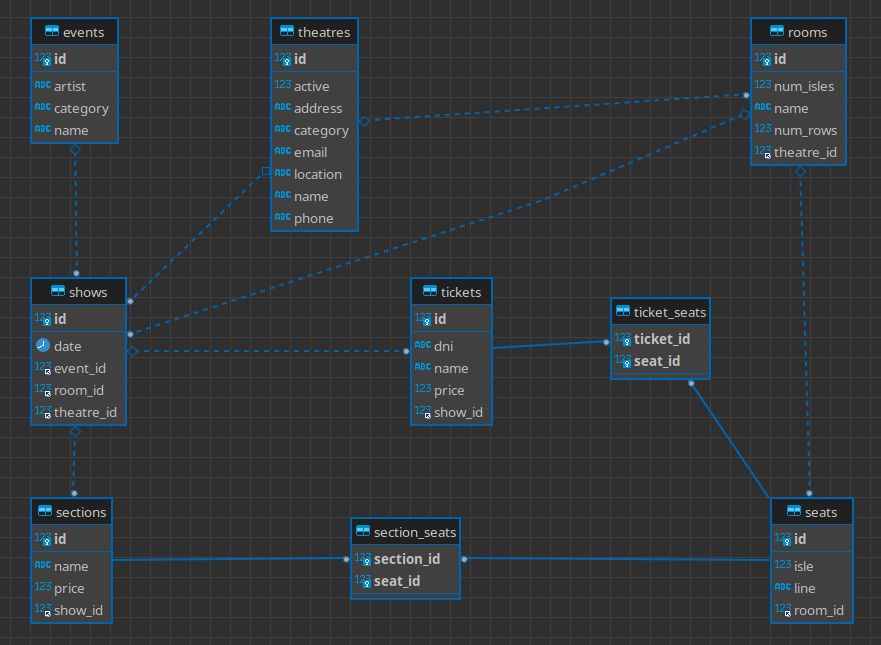

# MeLi Shows API

Este proyecto fue realizado para el challenge de MercadoLibre en Agosto 2022.

Se trata de una API Rest, desarrollada con java 11 sobre spring-boot y JPA.

## Modelo

El modelo de datos es el siguiente:



Como se puede observar, un evento puede tener N shows, y a su vez cada show puede tener M secciones de butacas.
Se puede considerar a un show como una función de una obra de teatro.
Las salas de teatro pueden tener diferentes configuraciones de secciones (grupos de butacas) por función o show, con diferente valor de entrada.

Un ticket es la representación de una reserva o compra de entradas. Cada ticket puede tener N butacas en diferentes secciones, y el precio es por el total de butacas reservadas. 


## Persistencia 

El proyecto se desarrolló con una DB MySQL 8 corriendo en docker.
Los datos de conexión a la DB se deben actualizar en el archivo de configuración application.yaml

```shell
docker run -d  \
-v ~/melishows/data:/var/lib/mysql \
-p 3306:3306 \
--name melishows \
-e MYSQL_DATABASE=melishows \
-e MYSQL_ROOT_PASSWORD=root \
-e MYSQL_USER=meli \
-e MYSQL_PASSWORD=meli \
mysql:8 --character-set-server=utf8mb4 --collation-server=utf8mb4_unicode_ci
```

Para la publicación de la aplicación en GCP, se optó por una base de datos H2 en memoria.

## Pruebas

Se adjunta una [colección de postman](docs/MELI_Shows.postman_collection.json) para ejecutar pruebas. 
Tener en cuenta que se debe definir la variable de entorno **baseurl**, que se usa como prefijo de todas las operaciones.

---
#### Listado de teatros

Esta operación devuelve todas las locaciones (salas de teatro). No soporta filtros ni ordenamiento.

** Request **
```shell
curl --location --request GET 'localhost:8080/meli/theatres'
```

** Response **
```json
[
  {
    "id": 1,
    "name": "TEATRO TIMBRE 4",
    "address": "MEXICO 3554",
    "location": "-34.6198045576998,-58.415882252113",
    "phone": "4931-6947",
    "email": "TIMBRE4@TIMBRE4.COM",
    "active": true,
    "category": "SALA_DE_TEATRO",
    "rooms": [
      {
        "id": 1,
        "name": "SALA ÚNICA",
        "seats": [
          {
            "id": 1,
            "row": "A",
            "isle": 1
          },
          {
            "id": 2,
            "row": "A",
            "isle": 2
          }
        ]
      }
    ]
  },
  {
    "id": 2,
    "name": "TEATRO ALVEAR",
    "address": "CORRIENTES AV. 1659",
    "location": "-34.6041919,-58.3901348",
    "phone": "",
    "email": "PRENSA@COMPLEJOTEATRAL.GOB.AR",
    "active": true,
    "category": "SALA_DE_TEATRO",
    "rooms": [
      {
        "id": 2,
        "name": "SALA A",
        "seats": []
      }]
  }
]
```

--- 
#### Teatro por Id 

Esta operación devuelve un único teatro o bien un error 404 si no se encuentra un resultado.

** Request **
```shell
curl --location --request GET 'localhost:8080/meli/theatre/3'
```

** Response **
```json
{
  "id": 1,
  "name": "TEATRO TIMBRE 4",
  "address": "MEXICO 3554",
  "location": "-34.6198045576998,-58.415882252113",
  "phone": "4931-6947",
  "email": "TIMBRE4@TIMBRE4.COM",
  "active": true,
  "category": "SALA_DE_TEATRO",
  "rooms": [
    {
      "id": 1,
      "name": "SALA ÚNICA",
      "seats": [
        {
          "id": 1,
          "row": "A",
          "isle": 1
        },
        {
          "id": 2,
          "row": "A",
          "isle": 2
        }
      ]
    }
  ]
}
```

---
#### Listado de eventos

Esta operación devuelve todos las eventos, con sus respectivos shows y secciones de butacas por precio.
Es una operación GET que soporta filtros como **query parameters**

** Request **

```shell
curl --location --request GET 'localhost:8080/meli/events?eventCategory=recital,comedia_musical&sort=id'
```

** Response **

```json
[
  {
    "id": 2,
    "name": "AGUA - DIARIO DE VIAJERAS",
    "artist": null,
    "category": "COMEDIA_MUSICAL",
    "shows": [
      {
        "id": 17,
        "date": "2022-08-27T02:15:00.000+00:00",
        "sections": [
          {
            "id": 29,
            "name": "Platea",
            "price": 1900.0,
            "seats": [
              {
                "id": 402,
                "row": "C",
                "isle": 3
              },
              {
                "id": 396,
                "row": "B",
                "isle": 4
              }
            ]
          }
        ]
      }
    ]
  }
]
```


** FILTROS **

  - name: El nombre del evento. Se realiza una búsqueda del tipo LIKE.
  - eventCategory: Es un listado separado por comas, de las posibles categorías del evento. Este campo es un enum que admite los valores:
    - DRAMA,
    - COMEDIA,
    - COMEDIA_MUSICAL,
    - MUSICAL,
    - RECITAL,
    - PELICULA
  - fromDate: La fecha desde la que se busca la función. El formato es ISO 8601.
  - toDate: La fecha máxima del show.
  - fromPrice: El valor mínimo de la entrada. El formato es double.
  - toPrice: El valor máximo de la entrada.

Todos estos parámetros de búsqueda son opcionales.

** ORDENAMIENTO **

Adicionalmente a los query parameters de filtro, se puede enviar un parámetro **sort**, en el cual se puede indicar un atributo del evento para definir un orden.
Por defecto se aplica el orden por **id** ascendente.
Se pueden dar varias ocurrencias del query parameter **sort**, y se tomarán en el orden en que estén definidas en los parámetros de la query. 
Cada ocurrencia del sort puede tener un string con el nombre de la propiedad, o un string separado con coma con el formato "prop,[asc|desc]".

Algunos ejemplos:
  - sort=name Ordena los resultados por el nombre del evento de forma ascendente
  - sort=name,desc  Ordena los resultados por el nombre de forma descendente
  - sort=name&sort=id,desc  Ordena por el nombre ascendente, y luego por el id de forma descendente

No se soportan propiedades sobre los objetos children del evento (show, sección, butaca, etc).

---
#### Show

Esta operación permite acceder directamente a una función por su ID. Devuelve un error 404 si no se encuentra.

** Request **
```shell
curl --location --request GET 'localhost:8080/meli/shows/38'
```

** Response **

```json
{
    "id": 2,
    "name": "AGUA - DIARIO DE VIAJERAS",
    "artist": null,
    "category": "COMEDIA_MUSICAL",
    "shows": [
      {
        "id": 17,
        "date": "2022-08-27T02:15:00.000+00:00",
        "sections": [
          {
            "id": 29,
            "name": "Platea",
            "price": 1900.0,
            "seats": [
              {
                "id": 402,
                "row": "C",
                "isle": 3
              },
              {
                "id": 396,
                "row": "B",
                "isle": 4
              }
            ]
          }
        ]
      }
    ]
}
```

---
#### Listado de butacas por función 

Esta operación devuelve todas las butacas para una función. Se deben pasar como **path parameter** (requeridos) el Id del evento y el Id del show.
El objetivo de esta operación es permitir al portal dibujar la sala completa con todas las filas y pasillos de butacas.

** Request **
```shell
curl --location --request GET 'localhost:8080/meli/events/3/shows/38/seats'
```

** Response **
```json
[
    {
        "id": 386,
        "row": "A",
        "isle": 1
    },
    {
        "id": 387,
        "row": "A",
        "isle": 2
    },
    {
        "id": 388,
        "row": "A",
        "isle": 3
    }
]
```

---
#### Listado de butacas disponibles para una función

Esta operación devuelve un listado de butacas disponibles con el precio. Recibe como **path parameter** (requeridos) los ids de evento y show.

** Request **
```shell
curl --location --request GET 'localhost:8080/meli/events/3/shows/38/available'
```

** Response **
```json
[
    {
        "id": 386,
        "row": "A",
        "isle": 1,
        "price": 5600.0
    },
    {
        "id": 387,
        "row": "A",
        "isle": 2,
        "price": 5600.0
    },
    {
        "id": 388,
        "row": "A",
        "isle": 3,
        "price": 5600.0
    }
]
```

--- 
#### Crear Ticket

Esta operación crea una reserva para la cantidad de asientes solicitada. Recibe como **path parameter** (requeridos) los ids de evento y show.
Devuelve la instancia de ticket generada con su id, precio total y los datos del usuario que realiza la compra.

** Request **

```shell
curl --location --request POST 'localhost:8080/meli/events/3/shows/789/ticket' \
--header 'Content-Type: application/json' \
--data-raw '{
    "show": {
        "id": 789
    },
    "dni": "30123456",
    "name": "test prueba",
    "seats": [
        {"id": 230 }
    ]
}'
```

** Response **
```json
{
    "id": 1,
    "seats": [
        {
            "id": 387,
            "row": "A",
            "isle": 2
        }
    ],
    "dni": "30123456",
    "name": "test prueba",
    "price": 5600.0
}
```